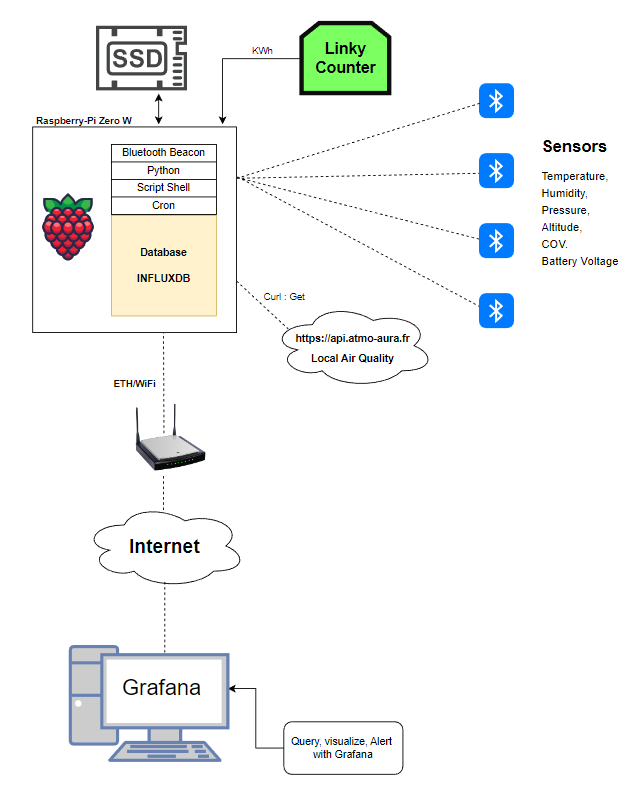

# __Raspberrypi Zero-W with data Sensor and InfluxdB__

 Collect data from Bluetooth Sensor (Temp, Hum, Press,Gaz,Batt Level)  
 Collect Linky Smart Energy Counter  (Uart)
 Collect Air Quality (grad data from web)  
 Collect I/O Event  (door event or other)
 Store data to InfluxdB  
 Display data from Grafana Cloud service  

 **Raspberry-Pi Zero W with Debian Bullseye OS and Python3.9  (Major update in June 2022)**  
    
   
    
## Bootcode.bin

The Rpi can't boot directly from USB but this little bootcode can help you.

Format an SD card as FAT32 and copy on the latest bootcode.bin. The SD card must be 
present in the Raspberry Pi for it to boot. Once bootcode.bin is loaded from the SD card,
the Raspberry Pi continues booting using USB host mode.

link for bootcode.bin
https://github.com/raspberrypi/firmware/raw/master/boot/bootcode.bin


## Install a Fresh Raspbian Lite image.(USB SSD disk)

Use Raspberry Pi Imager for creating the system on your USB SSD Disk    
Choose OS :   **Raspebrry Pi OS Lite(32-bit)**
This version use less than 400Mb of storage

Use **Option** to set I2C, Wifi, SSH, and Account Password


## UART, I2C

To enable I2C and UART edit the file /boot/config.txt and add this two
parameters:

```
> sudo vi /boot/config.txt

#enable I2C
dtparam=i2c_arm=on

#Enable UART
enable_uart=1
```
## Edit cmdline.txt

Edit also the file /boot/cmdline.txt and suppress the text :
The Uart port is dedicated for Linky data acquisition
```
console=serial0,115200  
```

## Reboot

Plug the SD card into the raspberry-pi, connect the USB SSD disk
to the port and reboot (wait almost 3min before login)

login:

```
> ssh pi@192.168.1.xx
```
use your password for login

## Configure TimeZone, Language

Set time-zone and language and enable I2C
```
> sudo raspi-config
```

## Update and upgrade system:

This can be very long ......:confused:

```
> sudo apt-get update  
> sudo apt-get upgrade  
```

## Install Git
```
> sudo apt-get install git -y
```

## Github : clone **Rasplogger** project
```
> cd $home
> git clone https://github.com/kroa38/RaspLogger.git
> cd Rasplogger/
```

## Add Packages

After boot install new packages.
```
> sudo apt-get install $(cat pkglist.txt) -y
```

## Grant the python executable permission to access BT raw socket data
```
sudo setcap 'cap_net_raw,cap_net_admin+eip' "$(readlink -f "$(which python3)")"
```

## Add Python Packages

```
> sudo pip install -r requirements.txt
```
## Beacontools (little fork)

locate where is installed the python package for **beacontools** by using this command
```
> python -m site
```
Generaly the package is in /usr/local/lib/python3.9/dist-packages/beacontools  
Go to the located directory and replace the 2 next files.
```
> sudo cp /home/pi/RaspLogger/beacontools_mod/device_filters.py .
> sudo cp /home/pi/RaspLogger/beacontools_mod/ibeacon.py packet_types/.
```
---

## __InfluxdB__  

- 1) Install InfluxdB  

```
> curl -sL https://repos.influxdata.com/influxdb.key | sudo apt-key add -  
> echo "deb https://repos.influxdata.com/debian bullseye stable" | sudo tee /etc/apt/sources.list.d/influxdb.list     
> sudo apt-get install influxdb  
> sudo apt-get install influxdb-client 
```

- 2) Edit File influxdb.conf  

```
> sudo nano /etc/influxdb/influxdb.conf
```
- 3) Modify data and http section  

```
[http]
  # Determines whether HTTP endpoint is enabled.
  enabled = true

  # The bind address used by the HTTP service.
  bind-address = ":8086"

  # Determines whether user authentication is enabled over HTTP/HTTPS.
  auth-enabled = false

```
- 4) Start service  

```
> sudo service influxdb restart
```
- 5) Enable service  

```
> sudo systemctl enable influxdb.service
```
- 6) or if you encounter an unmask error  


 ```
> sudo systemctl unmask influxdb.service
> sudo systemctl enable influxdb.service
```
- 7) Check if service is running and check version  

```
> sudo systemctl status influxdb.service
> influx --version

or

> curl -sL -I localhost:8086/ping

HTTP/1.1 204 No Content
Content-Type: application/json
Request-Id: 2f1d59f3-6011-11ed-8018-b827eb8b75bc
X-Influxdb-Build: OSS
X-Influxdb-Version: 1.8.10
X-Request-Id: 2f1d59f3-6011-11ed-8018-b827eb8b75bc
Date: Wed, 09 Nov 2022 09:30:43 GMT

Success is marked by the 204 No Content return value.
```

- 8) Init databases users  

This create 2 users one admin user and one reader user  

```
> python util_dbase.py
```
Important !!
option "auth-enabled = false" must be declared into  /etc/influxdb/influxdb.conf  
and be changed to "auth-enabled = true" after !  
  
  

- 8) Init Crontab

See README.MD into the 'cron' directory for shceduling the differents task with cron


---
## TIPS

- 8) Curl example

Here we need to count the number of sample from now -5h 
```  
curl -G http://localhost:8086/query --data-urlencode "u=username" --data-urlencode "p=password" --data-urlencode "db=Sensors" --data-urlencode "q=SELECT count(*) FROM \"Temperature\" WHERE (\"Sensor Type\" = '1' AND \"Sensor Number\" = '1' AND time > now() -5h)"

```  

- 8) Export database into CSV format

Use influx_inspect command  
```  
influx_inspect export -database ibeacon -datadir "/home/pi/USB_KEY/influxdb/data/" -waldir "/home/pi/USB_KEY/influxdb/wal/" -out "/home/pi/USB_KEY/tmp/ibeacon.csv"
```  
- 9) Import database  

Drop the previous database  

Influx CLI :  
```
 Drop database ibeacon  
```
After that exit influx cli and use influx command to import the database  
```
influx -username 'admin' -password 'aP45YhN45' -import -path "/home/pi/USB_KEY/tmp/ibeacon2.csv"  
```

After this import you must re-allow grants privileges for users and databases:  

 ex :  
```
grant all on "ibeacon" to "admin"  
grant read on "ibeacon" to "reader"  
```
---
## Database Backup

The script **db_backup.sh** automatically backup the entire database to the USB Key  
The script run once per day by using **Cron**.
---

## Infux CLI (Usefull command)

Connect to CLI with readable date:
```
influx -username 'admin' -password 'aP45YhN45' -precision RFC3339
```

---
## Internet Provider

configure NAT/PAT on your router to have access to SSH and InfluxdB

---
## Check if Raspberry Pi is alive by using Cronitor

see : https://cronitor.io/ and register to create your own monitor  
Personnaly i have added a 'Checks' every 6 minutes  
Type : TCP  
Endpoint : mypi.duckdns.org:8086


